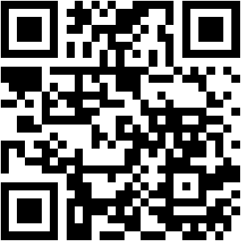

# RemoteHive Mobile

Android app for RemoteHive — remote job board & talent platform. React Native (Expo SDK 56).

## Quick Start

```bash
npm install --legacy-peer-deps
npx expo start
```

Scan the QR code below with **Expo Go** (install from Play Store), or press `a` in the terminal for Android emulator.



> **Note:** The QR above opens this repo. The **live Expo QR** appears in your terminal when you run `npx expo start` — scan that one to load the app on your phone.

## Without Android Studio (Physical Phone)

| Method | How |
|--------|-----|
| **Expo Go** (easiest) | `npx expo start` → scan QR from terminal with Expo Go app |
| **EAS APK** | `eas build --platform android --profile preview` → download + install |
| **Android Studio** | `npx expo run:android` (requires full Android SDK setup) |

## Env Variables

All set in `.env`. Uses the same Clerk + Supabase credentials as the web frontend:

```
EXPO_PUBLIC_CLERK_PUBLISHABLE_KEY=...
EXPO_PUBLIC_SUPABASE_URL=https://kvpgsbnwzsqflkeihnyo.supabase.co
EXPO_PUBLIC_SUPABASE_ANON_KEY=...
EXPO_PUBLIC_DJANGO_API_URL=https://admin.remotehive.in
```

## Stack

- **Framework:** React Native (Expo SDK 56)
- **Auth:** Clerk (`@clerk/clerk-expo`)
- **DB:** Supabase (reads), Django REST API (writes with validation)
- **Routing:** Expo Router (file-based)
- **State:** TanStack React Query
